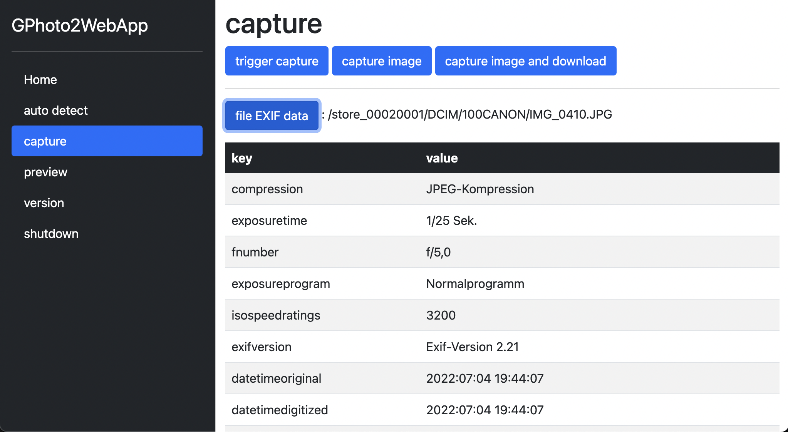
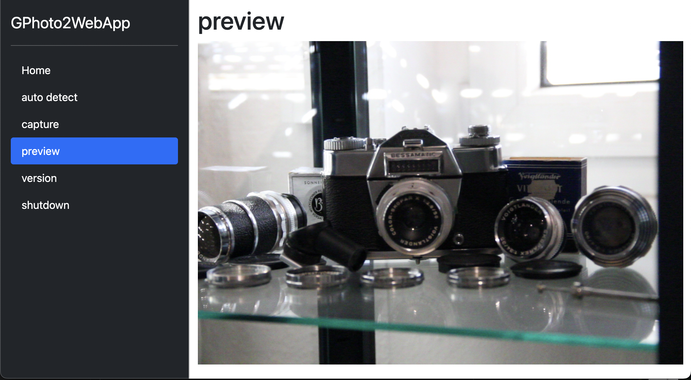
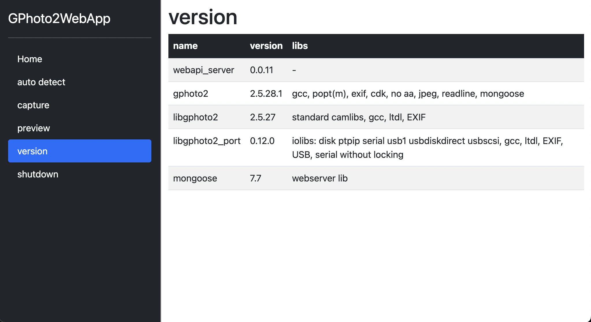

# gphoto2-webapp

This is a sample WebApp to demonstrate the usage of the `gphoto-webapi` server only.

[gphoto2 + ghoto2-webapi repository](https://github.com/thorsten-l/gphoto2)

July 2022, Thorsten Ludewig (t.ludewig@gmail.com)

## screenshots

